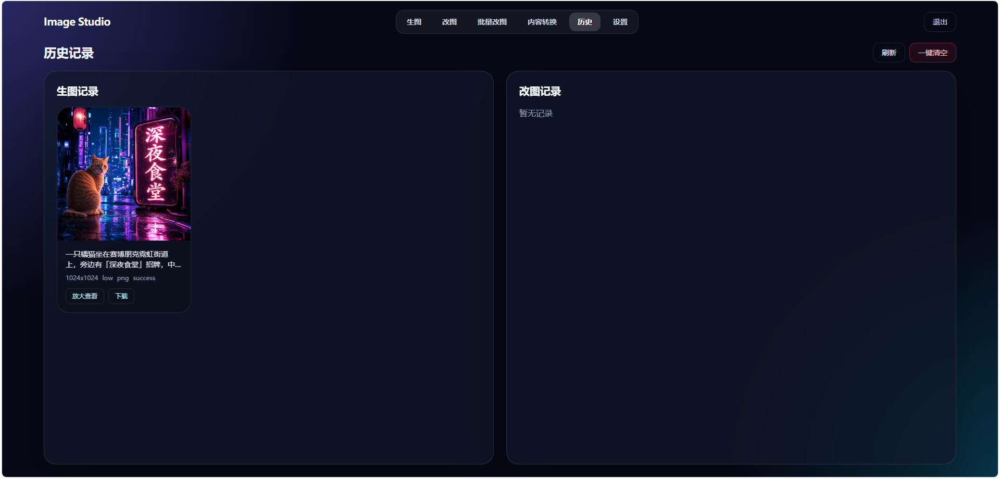

# GPT-Image 2.0 Web

基于 GPT-Image-2 的 AI 图像生成与编辑 Web 应用，支持用户认证、异步任务、提示词优化、单图/批量编辑和多参考图生成等功能。

## 兼容 OpenAI 格式

本项目完全兼容 OpenAI Images API 格式，只需在「设置」页填入你的 `Base URL` 和 `API Key` 即可使用。

支持的 API 端点：
- `POST {base_url}/images/generations` - 文字生成图片
- `POST {base_url}/images/edits` - 图片编辑（支持多图输入）

请求格式示例：
```json
{
  "model": "gpt-image-2",
  "prompt": "your prompt here",
  "images": [{"image_url": "data:image/png;base64,..."}],
  "size": "3840x2160",
  "quality": "high"
}
```

任何兼容 OpenAI Images API 的服务都可以直接使用，包括但不限于：
- OpenAI 官方 API
- Azure OpenAI
- 第三方兼容服务

## 功能特性

- **用户系统** - 注册/登录，JWT 认证
- **AI 生图** - 文字生成图片，支持多种尺寸和画质，默认 3840x2160 + high
- **AI 改图** - 单张图片编辑，支持提示词控制
- **参考图生成** - 上传 1-16 张有序参考图，通过 Image 1、Image 2 等编号在提示词中指定用途，固定生成一张新图
- **批量改图** - 多张图片批量处理，进度追踪，ZIP 打包下载
- **异步任务** - 提交后立即返回，后台处理，前端轮询状态，支持同步等待和上游异步轮询两种模式
- **并发提交** - 任务运行中可继续提交新任务，无需等待
- **提示词优化** - 点击灯泡按钮，调用独立配置的文本模型自动优化提示词，支持生图/改图/参考图三种模板
- **历史记录** - 用户独立的生成/编辑历史，支持单条删除和一键清空
- **个性化设置** - 每用户独立配置图片模型和文本模型
- **自动重试** - 上游超时/502/524 自动重试，最多 3 次

## 界面预览

### AI 生图


### AI 改图


### 批量改图


### 历史记录



## 技术栈

- **前端**: Vue 3 + Vite + TailwindCSS
- **后端**: Node.js + Express
- **数据库**: JSON 文件存储（轻量级，无需配置）
- **部署**: PM2 进程管理

## 快速开始

### 1. 克隆项目

```bash
git clone https://github.com/knoka0812/GPT-image-2.0-web.git
cd GPT-image-2.0-web
```

### 2. 安装依赖

```bash
npm install
```

### 3. 配置环境变量

```bash
cp .env.example .env
```

编辑 `.env` 文件：

```env
PORT=3003
JWT_SECRET=your-jwt-secret-here
UPLOAD_DIR=./uploads
```

### 4. 构建前端

```bash
npm run build
```

### 5. 启动服务

```bash
npm start
```

或使用 PM2：

```bash
pm2 start ecosystem.config.cjs
```

## 项目结构

```
├── src/                         # 前端源码
│   ├── views/                   # 页面组件
│   │   ├── Login.vue            # 登录/注册
│   │   ├── Generate.vue         # AI 生图
│   │   ├── EditImage.vue        # 单图编辑
│   │   ├── ReferenceGenerate.vue # 多参考图生成
│   │   ├── BatchEdit.vue        # 批量编辑
│   │   ├── History.vue          # 历史记录
│   │   └── Settings.vue         # 设置页
│   ├── components/              # 公共组件
│   │   ├── TaskStatus.vue       # 任务状态面板
│   │   ├── RecordCard.vue       # 历史记录卡片
│   │   └── PromptOptimizer.vue  # 提示词优化
│   ├── use-image-task.js        # 任务轮询 Hook
│   ├── task-feedback.js         # 任务反馈工具
│   ├── reference-images.js      # 参考图管理
│   ├── App.vue                  # 根组件
│   └── main.js                  # 入口
├── server/                      # 后端源码
│   ├── index.js                 # Express 主服务
│   ├── db.js                    # JSON 数据库
│   ├── auth.js                  # JWT 认证
│   ├── jobs.js                  # 异步任务注册表
│   ├── utils.js                 # 图片 API 调用与重试
│   ├── settings.js              # 模型设置
│   ├── reference.js             # 参考图校验与构建
│   └── prompt-optimizer.js      # 提示词优化与系统提示词
├── test/                        # 测试
├── package.json
├── vite.config.js
└── ecosystem.config.cjs         # PM2 配置
```

## API 说明

| 接口 | 方法 | 说明 |
|------|------|------|
| `/api/auth/register` | POST | 用户注册 |
| `/api/auth/login` | POST | 用户登录 |
| `/api/settings` | GET/POST | 获取/设置 API 配置（含图片模型和文本模型） |
| `/api/images/generate` | POST | AI 生图（异步，返回 jobId） |
| `/api/images/edit` | POST | 单图编辑（异步，返回 jobId） |
| `/api/images/reference` | POST | 1-16 张有序参考图生成（异步，返回 jobId） |
| `/api/images/tasks/:jobId` | GET | 查询异步任务状态 |
| `/api/images/edit/batch` | POST | 批量编辑 |
| `/api/images/edit/batch/:jobId` | GET | 查询批量任务进度 |
| `/api/optimize-prompt` | POST | 提示词优化 |
| `/api/history` | GET/DELETE | 历史记录 |
| `/api/history/:kind/:id` | DELETE | 删除单条历史记录 |

## 设置页配置

### 图片模型

用于生图、改图、参考图生成：

- 模型名称（如 `gpt-image-2`）
- Base URL（默认 `https://api.uselg.top/v1`）
- API Key

### 文本模型

用于提示词优化，独立于图片模型：

- 模型名称（如 `gpt-4o`）
- Base URL
- API Key

## 支持的图片尺寸

- 1024x1024
- 1536x1024
- 1024x1536
- 2048x2048
- 2160x3840
- 3840x2160

## 提示词优化

每个生成页面的提示词框右上角有灯泡按钮，点击后调用文本模型自动优化提示词：

- **生图模板** - 按主体/环境/构图/视觉/文字/必须满足/避免结构优化
- **编辑模板** - 先保留不变内容，再描述修改需求
- **参考图模板** - 编辑模板 + 参考图编号说明

优化完成后可在弹窗中编辑并采用，直接替换原提示词。

## License

MIT
