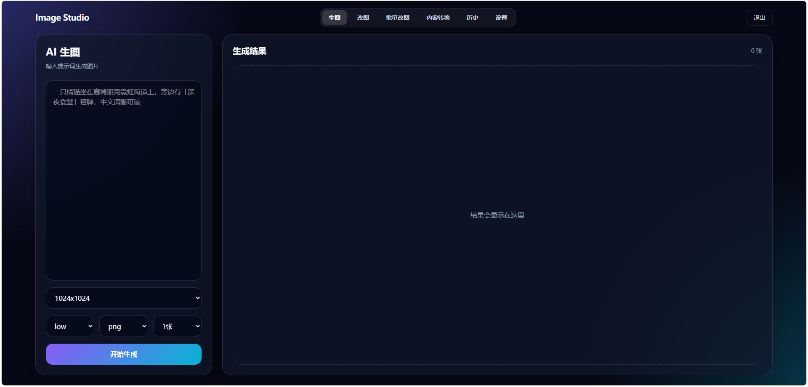
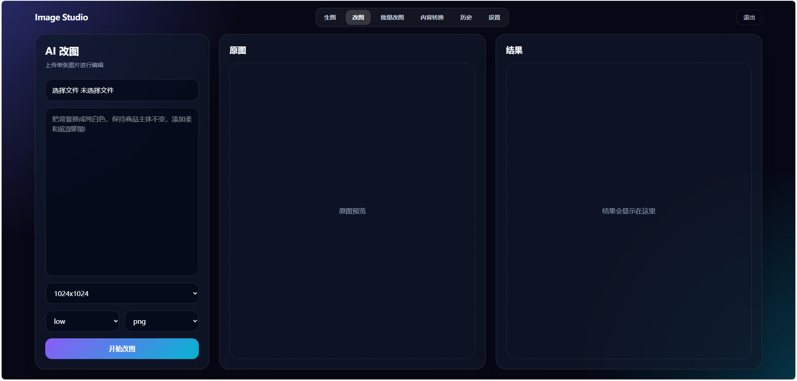
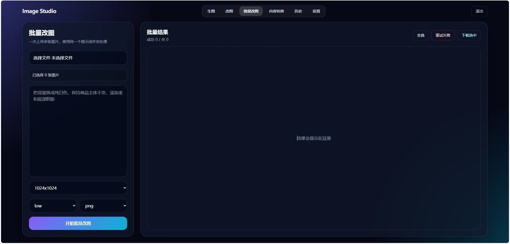

# GPT-Image 2.0 Web

基于 GPT-Image-2 的 AI 图像生成与编辑 Web 应用，支持用户认证、单图/批量编辑、内容转换等功能。

## 兼容 OpenAI 格式

本项目完全兼容 OpenAI Images API 格式，只需在「设置」页填入你的 `Base URL` 和 `API Key` 即可使用。

支持的 API 端点：
- `POST {base_url}/images/generations` — 文字生成图片
- `POST {base_url}/images/edits` — 图片编辑（支持多图输入）

请求格式示例：
```json
{
  "model": "gpt-image-2",
  "prompt": "your prompt here",
  "images": [{"image_url": "data:image/png;base64,..."}],
  "size": "1024x1024",
  "quality": "low"
}
```

任何兼容 OpenAI Images API 的服务都可以直接使用，包括但不限于：
- OpenAI 官方 API
- Azure OpenAI
- 第三方兼容服务

## 功能特性

- **用户系统** - 注册/登录，JWT 认证
- **AI 生图** - 文字生成图片，支持多种尺寸和画质
- **AI 改图** - 单张图片编辑，支持提示词控制
- **批量改图** - 多张图片批量处理，进度追踪，ZIP 打包下载
- **内容转换** - 参考 A 图内容 + B 图模板风格，智能转换生成
- **历史记录** - 用户独立的生成/编辑历史，一键清理
- **个性化设置** - 每用户独立 API Key 和 Base URL 配置
- **自动重试** - 上游超时/失败自动重试，支持备用线路切换

## 界面预览

### AI 生图



### AI 改图



### 批量改图



## 技术栈

- **前端**: Vue 3 + Vite + TailwindCSS
- **后端**: Node.js + Express
- **数据库**: JSON 文件存储（轻量级，无需配置）
- **部署**: PM2 进程管理

## 快速开始

### 1. 克隆项目

```bash
git clone https://github.com/knoka0812/GPT-image-2.0-web.git
cd GPT-image-2.0-web
```

### 2. 安装依赖

```bash
npm install
```

### 3. 配置环境变量

```bash
cp .env.example .env
```

编辑 `.env` 文件：

```env
PORT=3003
JWT_SECRET=your-jwt-secret-here
UPLOAD_DIR=./uploads
FALLBACK_BASE_URL=https://hk.testvideo.site/v1
```

### 4. 构建前端

```bash
npm run build
```

### 5. 启动服务

```bash
npm start
```

或使用 PM2：

```bash
pm2 start ecosystem.config.cjs
```

## 项目结构

```
├── src/                    # 前端源码
│   ├── views/              # 页面组件
│   │   ├── Login.vue       # 登录/注册
│   │   ├── Generate.vue    # AI 生图
│   │   ├── EditImage.vue   # 单图编辑
│   │   ├── BatchEdit.vue   # 批量编辑
│   │   ├── ContentTransform.vue  # 内容转换
│   │   ├── History.vue     # 历史记录
│   │   └── Settings.vue    # 设置页
│   ├── components/         # 公共组件
│   ├── App.vue             # 根组件
│   └── main.js             # 入口
├── server/                 # 后端源码
│   ├── index.js            # Express 主服务
│   ├── db.js               # JSON 数据库
│   ├── auth.js             # JWT 认证
│   └── utils.js            # 工具函数
├── package.json
├── vite.config.js
└── ecosystem.config.cjs    # PM2 配置
```

## API 说明

| 接口 | 方法 | 说明 |
|------|------|------|
| `/api/auth/register` | POST | 用户注册 |
| `/api/auth/login` | POST | 用户登录 |
| `/api/settings` | GET/POST | 获取/设置 API 配置 |
| `/api/images/generate` | POST | AI 生图 |
| `/api/images/edit` | POST | 单图编辑 |
| `/api/images/edit/batch` | POST | 批量编辑 |
| `/api/images/transform` | POST | 内容转换 |
| `/api/history` | GET/DELETE | 历史记录 |

## 支持的图片尺寸

- 1024x1024
- 1536x1024
- 1024x1536
- 2048x2048
- 2160x3840
- 3840x2160

## License

MIT
